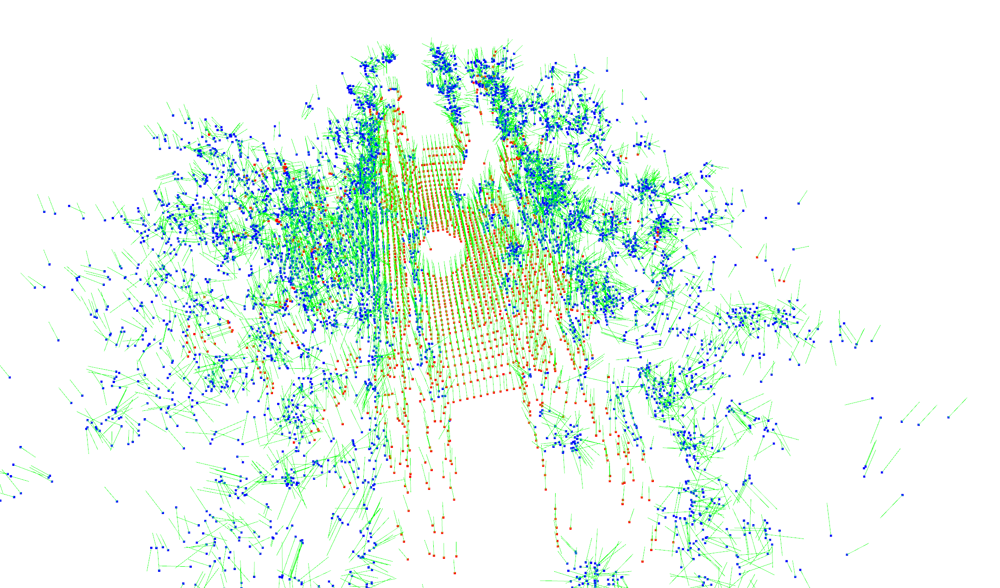
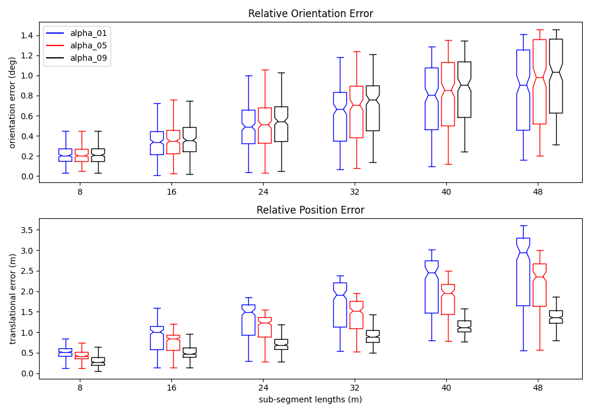
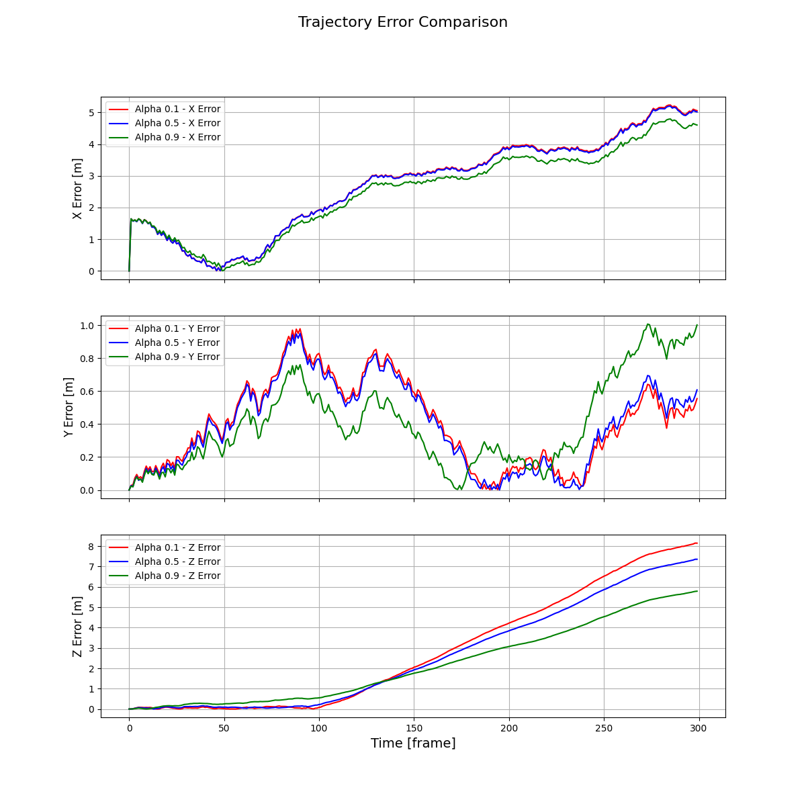

# WICP Project

This repository contains the implementation and evaluation of the Weighted Iterative Closest Point (WICP) algorithm. Below is a summary of the contents of this project and the associated visualizations.

## Directory Overview

- **main.py**: The main script for running the WICP algorithm.
- **utils.py**: Contains utility functions used throughout the project.
- **wicp.py**: Implements the WICP algorithm.
- **traj_plot.py**: Generates trajectory plots for visualization.
- **output/**: Directory for storing output files.
- **__pycache__/**: Cache directory for Python compiled files.

## WICP Algorithm

The WICP algorithm optimizes the alignment of point clouds by combining point-to-point loss and point-to-plane loss. A weight term, "α", is used to balance these losses:
- α: The weight for the point-to-plane loss.
- 1 - α: The weight for the point-to-point loss.

This allows the algorithm to adaptively emphasize either loss term based on the given dataset or requirements.

## Visualizations

### 1. Map Visualization
- **File:** `map.png`
- **Description:** A visualization of the map generated or used during the execution of the WICP algorithm.
- 

### 2. Normal Candidates
- **File:** `normal_candidate.png`
- **Description:** Displays the normal candidates used in the point cloud alignment process. Blue points represent non-planar regions, while red points represent planar regions.
- 

### 3. Error Comparison
- **File:** `error_comparsion.png`
- **Description:** This plot compares the error metrics for different values of \( \alpha \). \( \alpha \) is the weight for the point-to-plane loss, while \( 1 - \alpha \) is the weight for the point-to-point loss.
- 

### 4. Trajectory Evaluation
- **File:** `traj_eval.png`
- **Description:** A plot showing the evaluation metrics for the trajectory estimated by the WICP algorithm, with comparisons based on different values of \( \alpha \).
- 

## How to Run

1. Ensure you have all the dependencies installed.
2. Run the main script:
   ```bash
   python main.py
   ```
3. Visualize the results using the provided scripts and images.

## Notes

- The `output/` directory will contain intermediate results and final outputs.
- Use `traj_plot.py` to generate custom trajectory plots for different datasets.

Feel free to explore and modify the code to suit your project needs.
